# Striae Architecture Guide

## Table of Contents

1. [System Architecture Overview](#system-architecture-overview)
2. [High-Level Architecture](#high-level-architecture)
3. [Frontend Architecture](#frontend-architecture)
   - [Technology Stack](#technology-stack)
   - [Key Frontend Components](#key-frontend-components)
     - [1. Authentication System](#1-authentication-system)
     - [2. Canvas System](#2-canvas-system)
     - [3. Toolbar System](#3-toolbar-system)
     - [4. Sidebar Management](#4-sidebar-management)
     - [5. PDF Generation](#5-pdf-generation)
     - [6. Case Export System](#6-case-export-system)
     - [7. Case Import System](#7-case-import-system)
4. [Backend Architecture (Cloudflare Workers)](#backend-architecture-cloudflare-workers)
   - [Worker Services Overview](#worker-services-overview)
   - [1. User Worker (`workers/user-worker/`)](#1-user-worker-workersuser-worker)
   - [2. Image Worker (`workers/image-worker/`)](#2-image-worker-workersimage-worker)
   - [3. PDF Worker (`workers/pdf-worker/`)](#3-pdf-worker-workerspdf-worker)
   - [4. Data Worker (`workers/data-worker/`)](#4-data-worker-workersdata-worker)
   - [5. Keys Worker (`workers/keys-worker/`)](#5-keys-worker-workerskeys-worker)
   - [6. Turnstile Worker (`workers/turnstile-worker/`)](#6-turnstile-worker-workersturnstile-worker)
   - [7. Audit Worker (`workers/audit-worker/`)](#7-audit-worker-workersaudit-worker)
5. [Data Architecture](#data-architecture)
   - [Storage Systems](#storage-systems)
     - [1. Cloudflare KV (User Data Store)](#1-cloudflare-kv-user-data-store)
     - [2. Cloudflare R2 (Case and Annotation Data Store)](#2-cloudflare-r2-case-and-annotation-data-store)
     - [3. Cloudflare Images (File Storage)](#3-cloudflare-images-file-storage)
     - [4. Audit Trail System (R2 Storage)](#4-audit-trail-system-r2-storage)
     - [5. Firebase Authentication (Identity Provider)](#5-firebase-authentication-identity-provider)
6. [Security Architecture](#security-architecture)
   - [Authentication Flow](#authentication-flow)
   - [Security Measures](#security-measures)
     - [1. Multi-layered Authentication](#1-multi-layered-authentication)
     - [2. Data Protection](#2-data-protection)
     - [3. Access Controls](#3-access-controls)
   - [CORS Configuration](#cors-configuration)
7. [Performance Architecture](#performance-architecture)
   - [Edge Computing Benefits](#edge-computing-benefits)
   - [Optimization Strategies](#optimization-strategies)
     - [1. Frontend Optimizations](#1-frontend-optimizations)
     - [2. Backend Optimizations](#2-backend-optimizations)
8. [Scalability Considerations](#scalability-considerations)
   - [Horizontal Scaling](#horizontal-scaling)
   - [Data Partitioning](#data-partitioning)
9. [Monitoring and Observability](#monitoring-and-observability)
   - [Built-in Monitoring](#built-in-monitoring)
   - [Custom Logging](#custom-logging)
10. [Development Architecture](#development-architecture)
    - [Development Environment](#development-environment)
    - [CI/CD Pipeline](#cicd-pipeline)
11. [Future Architecture Considerations](#future-architecture-considerations)
    - [Custom Features](#custom-features)

## System Architecture Overview

Striae follows a modern cloud-native architecture built on Cloudflare's edge computing platform. The system is designed as a collection of microservices that work together to provide a comprehensive forensic annotation platform.

## High-Level Architecture

```mermaid
graph TB
    %% External Services (Top Level) - Force positioning with subgraph
    subgraph "External"
        Turnstile["🛡️ Turnstile<br/>Bot Protection"]
        SendLayer["📨 SendLayer<br/>Email Service"]
    end
    
    %% Platform Services
    subgraph "Platform"
        %% Authentication Layer
        Firebase["🔐 Firebase Auth<br/>Identity Provider"]
        
        %% Application Layer - Frontend
        Frontend["📱 React + Remix<br/>Cloudflare Pages<br/>(Frontend)"]
        
        %% Application Layer - Backend
        Backend["⚡ Cloudflare Workers<br/>(Backend)"]
        
        %% Storage Layer
        KV["🗃️ Cloudflare KV<br/>(User Database)"]
        R2["🗄️ Cloudflare R2<br/>(Case & Audit Data)"]
        Images["🖼️ Cloudflare Images<br/>(File Storage)"]
    end
    
    %% Authentication Flow
    Firebase -->|JWT| Frontend
    Turnstile -->|CAPTCHA| Frontend
    Frontend -->|API Key| SendLayer
    
    %% Application Communication
    Frontend <-->|API Keys<br />CORS| Backend
    
    %% Storage Connections
    Backend <--> KV
    Backend <--> R2
    Backend <--> Images
    
    %% Styling
    classDef external fill:#e1f5fe,stroke:#0277bd,stroke-width:2px
    classDef auth fill:#f3e5f5,stroke:#7b1fa2,stroke-width:2px
    classDef app fill:#e8f5e8,stroke:#2e7d32,stroke-width:2px
    classDef storage fill:#fff3e0,stroke:#ef6c00,stroke-width:2px
    
    class Turnstile,SendLayer external
    class Firebase auth
    class Frontend,Backend app
    class KV,R2,Images storage
```



## Frontend Architecture

### Technology Stack

- **Framework**: Remix (React-based full-stack framework)
- **Styling**: CSS Modules + Tailwind CSS
- **Type Safety**: TypeScript
- **Build Tool**: Vite
- **Deployment**: Cloudflare Pages

### Key Frontend Components

#### 1. Authentication System

- **Location**: `app/routes/auth/`
- **Components**: Login/Registration, MFA
- **Features**:
  - Firebase Authentication integration
  - Multi-factor authentication support
  - Email verification
  - Password reset functionality

#### 2. Canvas System

- **Location**: `app/components/canvas/`
- **Purpose**: Forensic image annotation
- **Features**:
  - High-resolution image display
  - Dynamic annotation overlay
  - Annotation state management
  - Interactive box annotation drawing system
  - Percentage-based coordinate system for device independence
  - Real-time visual feedback during annotation creation
- **Components**:
  - **Canvas**: Main image display and annotation overlay
  - **BoxAnnotations**: Interactive box drawing and management
  - **ToolbarColorSelector**: Dynamic color selection interface
  - **Confirmation**: Authenticated confirmation modal for comparison image verification workflow
- **Architecture**:
  - **Data Flow**: Canvas → BoxAnnotations → AnnotationData → Automatic Save
  - **Type Safety**: Centralized BoxAnnotation and AnnotationData interfaces
  - **Integration**: Seamless connection with toolbar controls and PDF generation

#### 3. Toolbar System

- **Location**: `app/components/toolbar/`
- **Purpose**: Central tool selection and application control
- **Features**:
  - Tool selection management (number, class, index, id, notes, box, print, visibility)
  - PDF generation controls
  - Box annotation mode with color selector
  - Visibility toggle for all annotation types
  - Active tool state tracking
- **Components**:
  - **Toolbar**: Main toolbar with tool buttons
  - **ToolbarColorSelector**: Dynamic color picker for box annotations
- **Architecture**:
  - **State Management**: Tool selection propagated to canvas and sidebar components
  - **Event Handling**: Tool activation triggers mode changes in annotation components
  - **Integration**: Box tool activation automatically displays color selector

#### 4. Sidebar Management

- **Location**: `app/components/sidebar/`
- **Features**:
  - Case and file management
  - Image selection
  - Annotation inputs
  - Visibility controls

#### 5. PDF Generation

- **Location**: `app/components/actions/`
- **Purpose**: Report generation
- **Features**:
  - Dynamic PDF creation
  - Annotation integration
  - Custom formatting

#### 6. Case Export System

- **Location**: `app/components/sidebar/case-export/` (UI) and `app/components/actions/case-export/` (business logic)
- **Purpose**: Comprehensive data export with multiple format support using modular architecture
- **Architecture**: Separated UI components and modular business logic for maintainability

**Business Logic Modules** (`app/components/actions/case-export/`):

- **Core Export**: Main export orchestration (`core-export.ts`)
- **Data Processing**: CSV generation and tabular formatting (`data-processing.ts`)
- **Download Handlers**: Browser download utilities (`download-handlers.ts`)
- **Metadata Helpers**: Forensic protection and Excel formatting (`metadata-helpers.ts`)
- **Types & Constants**: Shared definitions and CSV headers (`types-constants.ts`)
- **Validation**: Export prerequisites validation (`validation-utils.ts`)

**Features**:

- **Multi-Format Support**: JSON, CSV/Excel, and ZIP file generation
- **ZIP Export with Images**: Complete case packaging including all associated images
- **JSZip Integration**: Browser-based ZIP file creation with automatic image downloading
- **Split Box Annotation Format**: Box annotations split into separate rows for improved data analysis
- **Progress Tracking**: Real-time progress updates during export operations
- **Error Recovery**: Graceful handling of failed exports with detailed error reporting
- **Excel Multi-Worksheet**: Bulk exports create Excel files with summary and individual case worksheets

**Architecture Components**:

- **Export Engine**: Core export functionality with format-specific processors
- **Download Manager**: Browser-compatible file download system with proper MIME types
- **Image Fetcher**: Automatic image URL resolution and packaging for ZIP exports
- **Progress System**: Real-time callback system for export operation updates
- **Error Handler**: Comprehensive error recovery and reporting system

**Data Flow**:

1. User selects export format and options via sidebar UI
2. UI components call modular action functions from `case-export/`
3. Export engine collects case data from R2 storage
4. Format-specific processor transforms data (JSON/CSV/ZIP)
5. For ZIP exports: Images downloaded and packaged with data files
6. Browser download initiated with proper file handling
7. Progress callbacks update UI throughout operation

#### 7. Case Import System

- **Location**: `app/components/sidebar/case-import/` (UI) and `app/components/actions/case-import/` (business logic)
- **Purpose**: ZIP package import for read-only case review and collaboration using component composition pattern
- **Architecture**: Separated UI components and modular business logic for maintainable, testable code

**UI Architecture** (`app/components/sidebar/case-import/`):

- **Main Orchestrator**: `case-import.tsx` - Coordinates sub-components and hooks
- **UI Components**: Specialized components in `components/` directory for single responsibilities
- **Business Logic**: Custom hooks in `hooks/` directory for state management and processing
- **Utilities**: Pure functions in `utils/` directory for validation and file operations
- **Barrel Exports**: Centralized exports through `index.ts` for clean imports

**Business Logic Modules** (`app/components/actions/case-import/`):

- **Orchestrator**: Main import workflow coordination (`orchestrator.ts`)
- **Validation**: Security checks and integrity validation (`validation.ts`)
- **ZIP Processing**: Archive parsing and preview generation (`zip-processing.ts`)
- **Storage Operations**: R2 storage and case management (`storage-operations.ts`)
- **Image Operations**: Image upload and processing (`image-operations.ts`)
- **Annotation Import**: Annotation data mapping (`annotation-import.ts`)
- **Confirmation Import**: Confirmation data processing (`confirmation-import.ts`)

**Features**:

- **Complete ZIP Package Import**: Full case data and image import from exported ZIP packages
- **Read-Only Protection**: Imported cases are automatically set to read-only mode for secure review
- **Duplicate Prevention**: Prevents import if user was the original case analyst
- **Progress Tracking**: Multi-stage progress reporting with detailed status updates
- **Image Integration**: Automatic upload and association of all case images
- **Metadata Preservation**: Complete preservation of original export metadata and timestamps
- **Data Integrity**: Comprehensive validation of ZIP contents and case data structure

**Architectural Components**:

- **FileSelector Component**: File browser interface with drag-and-drop support
- **CasePreviewSection Component**: Case metadata preview and validation display
- **ProgressSection Component**: Real-time progress visualization with stage indicators
- **ExistingCaseSection Component**: Existing case detection and management interface
- **ConfirmationDialog Component**: Final import confirmation with security warnings
- **useImportState Hook**: Centralized state management for import workflow
- **useFilePreview Hook**: ZIP parsing, validation, and preview generation logic
- **useImportExecution Hook**: Import process orchestration with progress callbacks
- **File Validation Utils**: Pure functions for ZIP structure and content validation

**Data Flow**:

1. User selects ZIP file via FileSelector component
2. useFilePreview hook validates archive structure and extracts contents
3. CasePreviewSection displays case metadata and validation results
4. Security validator checks for conflicts (original analyst prevention)
5. ConfirmationDialog component presents final confirmation with security warnings
6. useImportExecution hook orchestrates the import process:
   - Image uploader processes and uploads all case images to image worker
   - Import engine stores case data in R2 with read-only metadata
   - User profile updated with read-only case reference
7. ProgressSection component updates UI throughout multi-stage operation

**Read-Only Case Management**:

- **Separate Storage**: Read-only cases stored with special metadata flags
- **User Profile Integration**: ReadOnlyCases array in UserData interface
- **Access Controls**: UI automatically enforces read-only restrictions
- **Original Metadata**: Preserves original export date, analyst, and hash data

## Backend Architecture (Cloudflare Workers)

### Worker Services Overview

The backend consists of seven specialized Cloudflare Workers, each handling specific functionality:

#### 1. User Worker (`workers/user-worker/`)

**Purpose**: User data management and authentication

**Responsibilities**:

- User profile CRUD operations
- Case listing management
- Data synchronization with Firebase Auth

**API Endpoints**:

- `GET /{userUid}` - Retrieve user data
- `PUT /{userUid}` - Create/update user
- `DELETE /{userUid}` - Delete user
- `PUT /{userUid}/cases` - Add cases to user
- `DELETE /{userUid}/cases` - Remove cases from user

**Key Features**:

- CORS protection for striae.org domain
- Custom authentication via X-Custom-Auth-Key header
- User data validation and sanitization
- Case deduplication logic

#### 2. Image Worker (`workers/image-worker/`)

**Purpose**: Image upload and management

**Responsibilities**:

- Image upload to Cloudflare Images
- Signed URL generation for secure access
- Image metadata management
- File validation and processing

**API Endpoints**:

- `POST /` - Upload new image
- `GET /{imageDeliveryPath}` - Generate signed URL for imagedelivery.net path
- `DELETE /{imageId}` - Delete image

**Key Features**:

- Bearer token authentication
- Automatic signed URL requirement for security
- Image format validation
- Error handling for upload failures

#### 3. PDF Worker (`workers/pdf-worker/`)

**Purpose**: PDF report generation

**Responsibilities**:

- Dynamic PDF document creation
- Annotation data integration
- Custom formatting and styling
- Report template management

**Technology**: Puppeteer for PDF generation

**API Endpoints**:

- `POST /` - Generate PDF report

**Key Features**:

- HTML to PDF conversion
- Annotation overlay rendering
- Box annotation rendering with exact positioning and styling
- Custom branding and headers
- Date and metadata integration
- Conditional annotation display based on toolbar state
- Type-safe data processing with centralized interfaces
- No authentication required

#### 4. Data Worker (`workers/data-worker/`)

**Purpose**: JSON file data management

**Responsibilities**:

- JSON file storage and retrieval
- File-based data operations
- Data validation for JSON format
- R2 bucket file management

**Storage**: Cloudflare R2 (STRIAE_DATA bucket)

**API Endpoints**:

- `GET /{filename}.json` - Retrieve JSON file data
- `PUT /{filename}.json` - Create/update JSON file
- `DELETE /{filename}.json` - Delete JSON file

**Key Features**:

- JSON file validation
- R2 bucket storage for file persistence
- Custom authentication via X-Custom-Auth-Key header
- Returns empty array for non-existent files

#### 5. Keys Worker (`workers/keys-worker/`)

**Purpose**: API key management and authentication

**Responsibilities**:

- API key retrieval and validation
- Access token management
- Authentication middleware
- Security policy enforcement

**API Endpoints**:

- `GET /{keyName}` - Retrieve environment variable value by name

**Key Features**:

- Secure key distribution for other workers
- Custom authentication via X-Custom-Auth-Key header

#### 6. Turnstile Worker (`workers/turnstile-worker/`)

**Purpose**: CAPTCHA verification

**Responsibilities**:

- Cloudflare Turnstile integration
- Bot protection
- Form submission validation
- Abuse prevention

**API Endpoints**:

- `POST /` - Verify Cloudflare Turnstile token

**Key Features**:

- No authentication required
- Token validation with Cloudflare Turnstile service
- IP address logging for verification
- JSON response with verification results

#### 7. Audit Worker (`workers/audit-worker/`)

**Purpose**: Forensic audit trail management and compliance logging

**Responsibilities**:

- Comprehensive audit event logging for all system activities
- Forensic data integrity and accountability tracking
- User action logging with detailed context and metadata
- Compliance audit trail generation and management
- Security incident logging and forensic analysis support

**Storage**: Cloudflare R2 dedicated `STRIAE_AUDIT` bucket (separate from STRIAE_DATA)

Storage Pattern: Organized by user and date for efficient retrieval
- `audit-trails/{userId}/{YYYY-MM-DD}.json` - Daily audit entries per user

**API Endpoints**:

- `POST /{userId}/` - Create new audit log entry for specific user
- `GET /{userId}/` - Retrieve today's audit logs for specific user
- `GET /{userId}/?startDate={YYYY-MM-DD}&endDate={YYYY-MM-DD}` - Retrieve audit logs for specific user within date range
- `GET /{userId}/?action={action}&result={result}&caseNumber={caseNumber}&limit={limit}&offset={offset}` - Advanced filtering with pagination

**Key Features**:

- **Comprehensive Event Tracking**: All user actions logged with structured metadata
  - Case management (create, rename, delete)
  - File operations (upload, access, delete)
  - Annotation operations (create, edit, delete)
  - Confirmation activities (export, import, confirm)
  - User authentication and profile changes
  - PDF generation and document operations

- **Forensic Accountability**:
  - Tamper-proof immutable entries that cannot be modified or deleted
  - User context preservation for chain of custody
  - Image file tracking with original IDs for forensic chain of custody
  - Security violation detection and logging
  - Cryptographic integrity validation with SHA-256 hashing

- **Compliance Features**:
  - Multi-factor authentication event logging
  - Role-based access control auditing
  - Data modification tracking with before/after states
  - Workflow phase categorization (casework, case-export, case-import, confirmation, user-management)
  - Result status tracking (success, failure, warning, blocked, pending)
  - Performance metrics (processing time, file sizes, validation steps)

- **Data Management**:
  - R2 bucket storage for persistent, durable audit trails (99.999999999% durability)
  - JSON-based audit event structure with ISO 8601 timestamps
  - Daily file organization for efficient querying and archival
  - Automatic aggregation for multi-day audit trail requests
  - Compliance-ready audit data format for reporting and evidence

- **Inter-Worker Communication**:
  - Integration with AuditService frontend client for creating audit entries
  - Automatic API key injection for worker-to-worker authentication
  - Non-blocking error handling (failures don't block main operations)
  - Retry logic with exponential backoff for transient failures

- **Data Consistency & Security**:
  - Immutable entries ensure data integrity (no updates/deletes)
  - Server-side timestamp generation to prevent clock skew
  - Permanent data retention for forensic compliance
  - Multi-format export (CSV, JSON, reports) for analysis

## Data Architecture

### Storage Systems Overview

Striae's data architecture separates concerns across multiple specialized storage systems:

- **User Data (KV)**: User profiles, authentication state, and case assignments
- **Case Data (R2)**: Forensic examination data, annotations, file references
- **Audit Trails (R2)**: Complete immutable audit logs for compliance and forensic accountability
- **Image Files**: High-performance image storage with global CDN distribution
- **Authentication**: Firebase for identity management and access control

**Worker-to-Storage Mapping**:

| Data Type | Storage | Worker | Purpose |
|-----------|---------|--------|---------|
| User Profiles | KV (`USER_DB`) | User Worker | User account management |
| Case Data | R2 (`striae-data/cases/`) | Data Worker | Forensic examination data |
| Audit Logs | R2 (`STRIAE_AUDIT/audit-trails/`) | Audit Worker | Compliance tracking |
| Images | Cloudflare Images | Image Worker | File storage & delivery |
| Annotations | R2 (`striae-data/`) | Data Worker | Annotation metadata |

**Key Separation Principle**:

The **Data Worker** manages case-specific operational data (cases, files, annotations), while the **Audit Worker** maintains separate immutable audit trails for forensic accountability. These workers do not share the same data structures - each maintains its own responsibility and data format to ensure:

- **Integrity**: Audit logs cannot be modified by case operations
- **Security**: Separation of concerns prevents unauthorized access
- **Compliance**: Audit data remains immutable for legal requirements
- **Performance**: Independent file organization for efficient querying

### Storage Systems

#### 1. Cloudflare KV (User Data Store)

**Namespaces**:

- `USER_DB` - User profiles and metadata

**Data Structure**:

```typescript
// User Data (KV Storage)
interface UserData {
  uid: string;
  email: string | null;
  firstName: string;
  lastName: string;
  company: string;
  permitted: boolean;
  cases: Array<{
    caseNumber: string;
    createdAt: string;
  }>;
  readOnlyCases?: Array<{
    caseNumber: string;
    importedAt: string;
    originalExportDate: string;
    originalExportedBy: string;
    sourceHash?: string;
    isReadOnly: true;
  }>;
  createdAt: string;
  updatedAt?: string;
}
```

#### 2. Cloudflare R2 (Case and Annotation Data Store)

**Buckets**:

- `striae-data` - Case files and annotation data

**Data Structure**:

```typescript
// Case Data (R2 Storage)
interface CaseData {
  caseNumber: string;
  files: FileData[];
  createdAt: string;
  updatedAt?: string;
}

// File Data (nested in CaseData)
interface FileData {
  id: string;
  originalFilename: string;
  uploadedAt: string;
}

// Annotation Data (R2 Storage)
interface AnnotationData {
  leftCase: string;
  rightCase: string;
  leftItem: string;
  rightItem: string;
  caseFontColor?: string;
  classType?: 'Bullet' | 'Cartridge Case' | 'Other';
  customClass?: string;
  classNote?: string;
  indexType?: 'number' | 'color';
  indexNumber?: string;
  indexColor?: string;
  supportLevel?: 'ID' | 'Exclusion' | 'Inconclusive';
  hasSubclass?: boolean;
  includeConfirmation: boolean;
  additionalNotes?: string;
  boxAnnotations?: BoxAnnotation[];
  updatedAt: string;
}

// Box Annotation (nested in AnnotationData)
interface BoxAnnotation {
  id: string;
  x: number;
  y: number;
  width: number;
  height: number;
  color: string;
  label?: string;
  timestamp: string;
}
```

#### 3. Cloudflare Images (File Storage)

**Purpose**: High-performance image storage and delivery

**Features**:

- Global CDN distribution
- Automatic image optimization
- Signed URL security
- Metadata preservation (if enabled)

#### 4. Audit Trail System (R2 Storage)

**Purpose**: Comprehensive forensic accountability and compliance tracking managed by Audit Worker

**Managed By**: Audit Worker (`workers/audit-worker/`) - Dedicated worker for audit operations

**Storage Location**: Cloudflare R2 bucket (`STRIAE_AUDIT` - Separate dedicated audit bucket)

**Separation from Case Data**: Unlike case data managed by Data Worker in the shared `STRIAE_DATA` bucket, audit entries:
- Use dedicated bucket: `STRIAE_AUDIT` bucket (completely separate from `STRIAE_DATA`)
- Immutable: Cannot be modified or deleted after creation
- Permanent: Retained indefinitely for forensic compliance
- Isolated: Physical separation prevents any accidental modification through case operations
- Independent: Maintains own bucket and file organization structure

**Data Structure**:

```typescript
// Audit Entry (R2 Storage)
interface ValidationAuditEntry {
  timestamp: string;           // ISO 8601 timestamp
  userId: string;             // User identifier
  userEmail: string;          // User email for identification
  action: AuditAction;        // What action was performed
  result: AuditResult;        // Success/failure/warning/blocked
  details: AuditDetails;      // Action-specific details
}

// Audit Trail (Complete workflow tracking)
interface AuditTrail {
  caseNumber: string;
  workflowId: string;         // Unique identifier linking related entries
  entries: ValidationAuditEntry[];
  summary: AuditSummary;
}

// Audit Summary (Compliance reporting)
interface AuditSummary {
  totalEvents: number;
  successfulEvents: number;
  failedEvents: number;
  warningEvents: number;
  workflowPhases: WorkflowPhase[];
  participatingUsers: string[];
  startTimestamp: string;
  endTimestamp: string;
  complianceStatus: 'compliant' | 'non-compliant' | 'pending';
  securityIncidents: number;
}
```

**Storage Organization**:

```
STRIAE_AUDIT (Dedicated R2 Bucket)
└── audit-trails/
    └── {userId}/
        └── {YYYY-MM-DD}.json    # Daily audit entries per user
```

**File Structure**: Each file contains a JSON array of `ValidationAuditEntry` objects:

```json
[
  {
    "timestamp": "2025-09-23T10:30:00.000Z",
    "userId": "aDzwq3G6IBVRJVCEFijdg7B0fwq2",
    "userEmail": "user@example.com",
    "action": "export",
    "result": "success",
    "details": { ... }
  }
]
```

**Key Features**:

- **Daily File Organization**: Separate audit files per user per day for efficient storage and retrieval
- **Immutable Entries**: Audit entries cannot be modified once created
- **Forensic Chain of Custody**: Complete traceability for legal compliance  
- **Export Capabilities**: CSV and JSON format generation via audit export service
- **Date Range Queries**: Support for retrieving entries across multiple days
- **Append-Only Storage**: New entries appended to existing daily files

#### 5. Firebase Authentication (Identity Provider)

**Purpose**: User authentication and identity management

**Features**:

- Email/password authentication
- Multi-factor authentication
- Email verification
- Session management

## Security Architecture

### Authentication Flow

1. **User Login**: Firebase Authentication validates credentials
2. **Token Generation**: Firebase provides JWT tokens
3. **API Key Retrieval**: Keys Worker retrieves API keys for Worker authentication
4. **Request Authorization**: Each Worker validates requests using custom auth headers

### Security Measures

#### 1. Multi-layered Authentication

- Firebase JWT tokens for client authentication
- Custom API keys for Worker-to-Worker communication
- CORS policies restricting access to striae.org domain

#### 2. Data Protection

- All data transmission over HTTPS/TLS
- Signed URLs for image access
- No plaintext storage of sensitive data
- AES-256 encryption for stored data in R2 and KV storage¹

#### 3. Access Controls

- Role-based permissions (not yet implemented)
- User data segregation
- Audit logging for data access
- Rate limiting and abuse prevention

### CORS Configuration

All workers implement strict CORS policies:

```javascript
const corsHeaders = {
  'Access-Control-Allow-Origin': 'https://www.striae.org',
  'Access-Control-Allow-Methods': 'GET, PUT, DELETE, OPTIONS',
  'Access-Control-Allow-Headers': 'Content-Type, X-Custom-Auth-Key',
  'Content-Type': 'application/json'
};
```

## Performance Architecture

### Edge Computing Benefits

- **Global Distribution**: Cloudflare's edge network ensures low latency worldwide
- **Caching**: Intelligent caching for static assets and API responses
- **Load Balancing**: Automatic traffic distribution across edge locations
- **DDoS Protection**: Built-in protection against attacks

### Optimization Strategies

#### 1. Frontend Optimizations

- Code splitting with Remix
- Image optimization with Cloudflare Images
- CSS optimization with Tailwind CSS
- TypeScript for development efficiency

#### 2. Backend Optimizations

- Lightweight Workers with minimal cold start time
- Efficient KV/R2 operations with proper key design
- Request deduplication and caching
- Optimized PDF generation with Puppeteer

## Scalability Considerations

### Horizontal Scaling

- Workers automatically scale with demand
- KV/R2 storage scales independently
- Edge locations distribute load globally

### Data Partitioning

- User data partitioned by UID
- Case data organized by case number
- Annotations linked to specific cases and image IDs

## Monitoring and Observability

### Built-in Monitoring

- Cloudflare Analytics for traffic and performance
- Worker execution metrics
- Error tracking and logging
- Firebase Authentication analytics

### Custom Logging

- Structured logging in Workers
- Error aggregation and reporting
- Performance metric collection
- User activity tracking

## Development Architecture

### Development Environment

- Local development with Wrangler CLI
- Hot reloading with Vite
- TypeScript compilation

### CI/CD Pipeline

- Git-based deployment
- Automated testing
- Environment-specific configurations
- Rollback capabilities

## Future Architecture Considerations

### Custom Features

- Role-based access control and operations
- Agency-based report formatting

---

## References

¹ Cloudflare uses AES-256 encryption with GCM (Galois/Counter Mode) for data at rest:

- [Cloudflare R2 Data Security](https://developers.cloudflare.com/r2/reference/data-security/)
- [Cloudflare KV Data Security](https://developers.cloudflare.com/kv/reference/data-security/)
