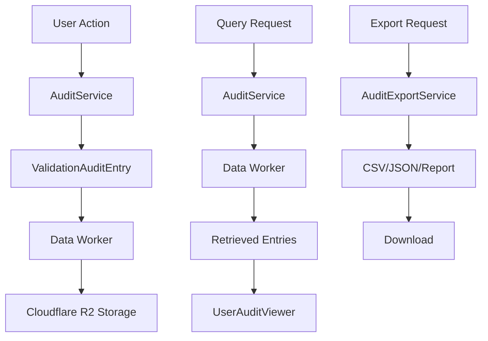

# Audit Trail System

## Overview

Striae's audit trail system provides comprehensive forensic accountability and compliance tracking for all user actions and system events. The system is designed to meet stringent requirements for forensic examination workflows, ensuring complete traceability and integrity of all operations.

## Table of Contents

- [Overview](#overview)
- [Key Features](#key-features)
- [System Architecture](#system-architecture)
- [Core Components](#core-components)
- [Audit Entry Structure](#audit-entry-structure)
- [Workflow Phases](#workflow-phases)
- [Creating Audit Entries](#creating-audit-entries)
- [Querying Audit Data](#querying-audit-data)
- [Export Functionality](#export-functionality)
- [User Interface Components](#user-interface-components)
- [Security and Compliance](#security-and-compliance)
- [Performance Considerations](#performance-considerations)
- [Best Practices](#best-practices)
- [API Reference](#api-reference)
- [Troubleshooting](#troubleshooting)

## Key Features

### 🔍 Comprehensive Tracking

- **All User Actions**: Login/logout, case management, file operations, annotations
- **System Events**: Security incidents, validation failures, performance metrics
- **Forensic Chain of Custody**: Complete traceability for legal compliance

### 📊 Multi-Format Export

- **CSV Export**: Excel-compatible format for data analysis
- **JSON Export**: Technical format for system integration
- **Summary Reports**: Human-readable compliance reports

### 🔒 Security & Compliance

- **Tamper-Proof**: Immutable audit entries with integrity validation
- **Forensic Standards**: Meets requirements for legal evidence handling

### 📈 Advanced Analytics

- **Performance Metrics**: Processing times, file sizes, validation steps
- **Compliance Status**: Real-time compliance monitoring
- **Security Monitoring**: Automated incident detection and reporting

## System Architecture

### Data Flow



### Storage Architecture

- **Primary Storage**: Cloudflare R2 data files organized by user/day
- **Indexing**: Key-based indexing for efficient queries
- **Durability**: 99.999999999% (eleven 9s) annual durability with automatic replication across Cloudflare's infrastructure³
- **Data Retention**: Permanent storage - all audit data is retained indefinitely for forensic compliance

## Core Components

### 1. AuditService (`~/services/audit.service.ts`)

Central service for creating and retrieving audit entries.

```typescript
import { auditService } from '~/services/audit.service';

// Create audit entry
await auditService.createAuditEntry({
  userId: user.uid,
  userEmail: user.email,
  action: 'file-upload',
  result: 'success',
  fileName: 'evidence.jpg',
  fileType: 'image-file',
  caseNumber: 'CASE-2025-001'
});

// Query audit entries
const entries = await auditService.getAuditEntriesForUser(userId, {
  caseNumber: 'CASE-2025-001',
  startDate: '2025-01-01T00:00:00Z',
  limit: 100
});
```

### 2. AuditExportService (`~/services/audit-export.service.ts`)

Handles exporting audit data in multiple formats.

```typescript
import { auditExportService } from '~/services/audit-export.service';

// Export to CSV
auditExportService.exportToCSV(entries, 'audit-report.csv');

// Export to JSON
auditExportService.exportToJSON(entries, 'audit-data.json');

// Generate summary report
const report = auditExportService.generateReportSummary(auditTrail);
```

### 3. UserAuditViewer Component

React component for displaying and interacting with audit data.

```typescript
import { UserAuditViewer } from '~/components/audit/user-audit-viewer';

<UserAuditViewer
  isOpen={isAuditViewerOpen}
  onClose={() => setIsAuditViewerOpen(false)}
  caseNumber="CASE-2025-001" // Optional: filter by case
  title="Case Audit Trail" // Optional: custom title
/>
```

## Audit Entry Structure

### Core Structure

```typescript
interface ValidationAuditEntry {
  timestamp: string;           // ISO 8601 timestamp
  userId: string;             // User identifier
  userEmail: string;          // User email for identification
  action: AuditAction;        // What action was performed
  result: AuditResult;        // Success/failure/warning/blocked
  details: AuditDetails;      // Action-specific details
}
```

### Supported Actions

> **Note**: The audit system uses concise action names (`'export'`, `'import'`, `'confirm'`) in combination with workflow phases (`'case-export'`, `'case-import'`, `'confirmation'`) to categorize different types of operations. Actions define what happened, while workflow phases provide the context.

#### Case Management

- `case-create` - New case creation
- `case-rename` - Case name changes
- `case-delete` - Case deletion

#### File Operations

- `file-upload` - File uploads to cases
- `file-delete` - File deletions
- `file-access` - File access/viewing

#### Annotation Operations

- `annotation-create` - New annotations
- `annotation-edit` - Annotation modifications
- `annotation-delete` - Annotation removal

#### User & Session Management

- `user-login` - User authentication
- `user-logout` - Session termination
- `user-profile-update` - Profile changes
- `user-password-reset` - Password resets
- `user-account-delete` - Account deletion

#### Confirmation Workflow

- `export` - Case package exports  
- `import` - Case package imports
- `confirm` - Confirmation creation

*Note: These concise actions are used with workflow phases `'case-export'`, `'case-import'`, and `'confirmation'` respectively to provide full context.*

#### Document Generation

- `pdf-generate` - PDF report generation

#### Security & Monitoring

- `security-violation` - Security incidents

### Result Types

- `success` - Operation completed successfully
- `failure` - Operation failed
- `warning` - Operation completed with warnings
- `blocked` - Operation was blocked by security
- `pending` - Operation is in progress

## Workflow Phases

Audit entries are categorized by workflow phase for better organization:

### Casework (`casework`)

All standard forensic examination activities:

- Case management (create, rename, delete)
- File operations (upload, access, delete)
- Annotation operations (create, edit, delete)
- PDF generation

### Case Export (`case-export`)

Dedicated workflow phase for case package exporting:

- Uses action: `'export'`
- Case data preparation
- File packaging
- Export validation

### Case Import (`case-import`)

Dedicated workflow phase for case package importing:

- Uses action: `'import'`
- Package validation
- Data extraction
- Import processing

### Confirmation (`confirmation`)

Confirmation workflow phase activities:

- Uses action: `'confirm'` for confirmation creation
- Uses action: `'export'` for confirmation exports  
- Uses action: `'import'` for confirmation imports
- Review processes and validation

### User Management (`user-management`)

User and session activities:

- Authentication events
- Profile updates
- Account management

## Creating Audit Entries

### Basic Usage

```typescript
import { auditService } from '~/services/audit.service';

await auditService.logEvent({
  userId: user.uid,
  userEmail: user.email,
  action: 'annotation-create',
  result: 'success',
  fileName: 'evidence.jpg',
  caseNumber: 'CASE-2025-001',
  workflowPhase: 'casework',
  annotationDetails: {
    annotationType: 'measurement',
    tool: 'ruler',
    canvasPosition: { x: 100, y: 200 }
  }
});
```

### With Performance Metrics

```typescript
const startTime = Date.now();
// ... perform operation ...
const processingTime = Date.now() - startTime;

await auditService.logEvent({
  userId: user.uid,
  userEmail: user.email,
  action: 'file-upload',
  result: 'success',
  fileName: 'large-image.tiff',
  performanceMetrics: {
    processingTimeMs: processingTime,
    fileSizeBytes: fileSize
  }
});
```

### With Security Checks

```typescript
await auditService.logEvent({
  userId: user.uid,
  userEmail: user.email,
  action: 'confirm',
  result: 'blocked',
  validationErrors: ['Self-confirmation not allowed'],
  securityChecks: {
    selfConfirmationPrevented: true,
    fileIntegrityValid: true,
    exporterUidValidated: false
  }
});
```

## Querying Audit Data

### User-Specific Queries

```typescript
// All entries for a user
const userEntries = await auditService.getAuditEntriesForUser(userId);

// Filtered by date range
const recentEntries = await auditService.getAuditEntriesForUser(userId, {
  startDate: '2025-01-01T00:00:00Z',
  endDate: '2025-01-31T23:59:59Z',
  limit: 100
});

// Filtered by case
const caseEntries = await auditService.getAuditEntriesForUser(userId, {
  caseNumber: 'CASE-2025-001'
});
```

### Advanced Filtering

```typescript
const filteredEntries = await auditService.getAuditEntriesForUser(userId, {
  action: 'file-upload',
  result: 'success',
  workflowPhase: 'casework',
  startDate: '2025-01-01T00:00:00Z',
  limit: 50,
  offset: 0
});
```

### Building Audit Trails

```typescript
// Create comprehensive audit trail for a case
const entries = await auditService.getAuditEntriesForUser(userId, {
  caseNumber: 'CASE-2025-001'
});

const auditTrail: AuditTrail = {
  caseNumber: 'CASE-2025-001',
  workflowId: `workflow-${caseNumber}-${userId}`,
  entries,
  summary: {
    totalEvents: entries.length,
    successfulEvents: entries.filter(e => e.result === 'success').length,
    failedEvents: entries.filter(e => e.result === 'failure').length,
    // ... calculate other summary fields
  }
};
```

## Export Functionality

### CSV Export

Exports audit data in Excel-compatible CSV format with comprehensive field coverage:

```typescript
// Basic CSV export
auditExportService.exportToCSV(entries, 'user-audit.csv');

// Full audit trail CSV with summary
auditExportService.exportAuditTrailToCSV(auditTrail, 'case-audit.csv');
```

**CSV Fields Include:**
- Timestamp, User Email, Action, Result
- File Name, File Type, Case Number
- File Details (ID, size, MIME type, etc.)
- Annotation Details (type, tool, position)
- Performance Metrics (processing time, validation steps)
- Security Information (hash validation, security checks)

### JSON Export

Technical format for system integration and detailed analysis:

```typescript
// Basic JSON export
auditExportService.exportToJSON(entries, 'audit-data.json');

// Full audit trail JSON
auditExportService.exportAuditTrailToJSON(auditTrail, 'case-trail.json');
```

### Summary Reports

Human-readable compliance reports:

```typescript
const reportContent = auditExportService.generateReportSummary(auditTrail);
// Creates formatted text report with:
// - Summary statistics
// - Compliance status
// - Timeline information
// - Participant list
// - Workflow phases
```

### Filename Generation

Automatic filename generation with timestamps:

```typescript
const filename = auditExportService.generateFilename(
  'case',           // 'case' or 'user'
  'CASE-2025-001',  // identifier
  'csv'             // format
);
// Result: striae-audit-case-CASE-2025-001-2025-09-23T14-30-15.csv
```

## User Interface Components

### UserAuditViewer Component

Comprehensive audit trail viewer with filtering and export capabilities.

#### Features

- **Real-time Data**: Live audit trail updates
- **Advanced Filtering**: By date, action, result, case number
- **Multi-format Export**: CSV, JSON, and summary reports
- **Responsive Design**: Desktop-optimized interface
- **Search & Filter**: Complex filtering combinations

#### Usage

```typescript
import { UserAuditViewer } from '~/components/audit/user-audit-viewer';

function CaseManagement() {
  const [showAudit, setShowAudit] = useState(false);

  return (
    <>
      <button onClick={() => setShowAudit(true)}>
        View Audit Trail
      </button>
      
      <UserAuditViewer
        isOpen={showAudit}
        onClose={() => setShowAudit(false)}
        caseNumber="CASE-2025-001"
        title="Case Audit Trail"
      />
    </>
  );
}
```

#### Props

```typescript
interface UserAuditViewerProps {
  isOpen: boolean;           // Modal visibility
  onClose: () => void;       // Close handler
  caseNumber?: string;       // Optional case filter
  title?: string;            // Optional custom title
}
```

### Component Architecture

```
UserAuditViewer/
├── Header (title, export buttons, close)
├── Summary Section (statistics, user info)
├── Filters Section (date, case, action, result)
└── Entries List (detailed audit entries)
```

## Security and Compliance

### Data Integrity

- **Immutable Entries**: Audit entries cannot be modified once created
- **Hash Validation**: File integrity verification for uploads
- **Tamper Detection**: Cryptographic validation of audit data

### Access Control

- **User Isolation**: Users can only access their own audit data
- **Secure Storage**: Data encrypted at rest using AES-256 encryption in Cloudflare R2¹ and KV²

### Compliance Features

- **Forensic Standards**: Meets requirements for legal evidence
- **Chain of Custody**: Complete traceability of all operations
- **Audit Completeness**: No gaps in audit trail coverage
- **Export Validation**: Integrity checks on exported data

### Security Monitoring

Automatic detection and logging of:
- Self-confirmation attempts (blocked)
- Unauthorized access attempts
- Data integrity violations
- Suspicious user behavior patterns

## Performance Considerations

### Storage Optimization

- **Efficient Indexing**: User ID and timestamp-based indexing
- **Batch Operations**: Grouping related audit entries
- **Data Compression**: Optimized storage format
- **Permanent Storage**: All audit data is preserved indefinitely for forensic integrity

### Query Performance

- **Pagination**: Limit and offset for large datasets
- **Date Range Filtering**: Efficient time-based queries
- **Result Caching**: Cache frequently accessed data
- **Async Processing**: Non-blocking audit operations

### Export Performance

- **Streaming Export**: Handle large datasets efficiently
- **Background Processing**: Export operations don't block UI
- **Progress Indicators**: User feedback for long operations
- **Memory Management**: Efficient processing of large audit trails

## Best Practices

### Creating Audit Entries

```typescript
// ✅ Good: Comprehensive audit entry
await auditService.createAuditEntry({
  userId: user.uid,
  userEmail: user.email,
  action: 'file-upload',
  result: 'success',
  fileName: file.name,
  fileType: 'image-file',
  caseNumber: currentCase.number,
  workflowPhase: 'casework',
  fileDetails: {
    fileId: uploadedFile.id,
    originalFileName: file.name,
    fileSize: file.size,
    mimeType: file.type,
    uploadMethod: 'drag-drop'
  },
  performanceMetrics: {
    processingTimeMs: uploadTime,
    fileSizeBytes: file.size
  }
});

// ❌ Bad: Minimal audit entry
await auditService.createAuditEntry({
  userId: user.uid,
  action: 'file-upload',
  result: 'success'
});
```

### Error Handling

```typescript
try {
  await performOperation();
  
  // Success audit entry
  await auditService.createAuditEntry({
    // ... success details
    result: 'success'
  });
} catch (error) {
  // Failure audit entry
  await auditService.createAuditEntry({
    // ... operation details
    result: 'failure',
    validationErrors: [error.message]
  });
  
  throw error; // Re-throw for upstream handling
}
```

### Performance Optimization

```typescript
// ✅ Good: Efficient querying with limits
const entries = await auditService.getAuditEntriesForUser(userId, {
  limit: 100,
  offset: page * 100
});

// ❌ Bad: Loading all entries at once
const allEntries = await auditService.getAuditEntriesForUser(userId);
```

### Security Considerations

```typescript
// ✅ Good: Include security validation results
await auditService.logEvent({
  // ... other fields
  securityChecks: {
    selfConfirmationPrevented: !canConfirmOwn,
    fileIntegrityValid: hashValid,
    exporterUidValidated: exporterValid
  }
});

// ✅ Good: Log security violations
if (securityViolation) {
  await auditService.logSecurityViolation(
    user, 
    'unauthorized-access',
    'high',
    'Attempted access to restricted resource',
    resourcePath
  );
}
```

## API Reference

### AuditService Methods

#### Core Methods

#### `logEvent(params: CreateAuditEntryParams): Promise<void>`

Creates a new audit entry with full control over all parameters.

**Parameters:**
- `params` - Audit entry creation parameters

#### Specialized Logging Methods

The service provides specialized methods for common audit scenarios:

#### `logCaseExport(user, caseNumber, fileName, result, errors?, performanceMetrics?): Promise<void>`

Logs case export operations with built-in security checks.

#### `logCaseImport(user, caseNumber, fileName, result, hashValid, errors?, originalExaminerUid?, performanceMetrics?): Promise<void>`

Logs case import operations with integrity validation.

#### `logConfirmationCreation(user, caseNumber, confirmationId, result, errors?, originalExaminerUid?, performanceMetrics?, imageFileId?, originalImageFileName?): Promise<void>`

Logs confirmation creation with self-confirmation prevention checks.

#### `logFileUpload(user, fileName, fileSize, mimeType, uploadMethod, caseNumber, result?, processingTime?, fileId?): Promise<void>`

Logs file upload operations with performance metrics.

#### `logAnnotationCreate(user, annotationId, annotationType, annotationData, caseNumber, tool?, imageFileId?, originalImageFileName?): Promise<void>`

Logs annotation creation with canvas position tracking.

#### `logUserLogin(user, sessionId, loginMethod, userAgent?): Promise<void>`

Logs user login events with session tracking.

#### `logSecurityViolation(user, incidentType, severity, description, targetResource?, blockedBySystem?): Promise<void>`

Logs security violations with incident tracking.

**Example:**
```typescript
await auditService.createAuditEntry({
  userId: 'user123',
  userEmail: 'user@example.com',
  action: 'case-create',
  result: 'success',
  caseNumber: 'CASE-2025-001'
});
```

#### `getAuditEntriesForUser(userId: string, params?: AuditQueryParams): Promise<ValidationAuditEntry[]>`

Retrieves audit entries for a specific user.

**Parameters:**
- `userId` - User identifier
- `params` - Optional query parameters

**Example:**
```typescript
const entries = await auditService.getAuditEntriesForUser('user123', {
  caseNumber: 'CASE-2025-001',
  limit: 50
});
```

### AuditExportService Methods

#### `exportToCSV(entries: ValidationAuditEntry[], filename: string): void`

Exports audit entries to CSV format.

#### `exportToJSON(entries: ValidationAuditEntry[], filename: string): void`

Exports audit entries to JSON format.

#### `exportAuditTrailToCSV(auditTrail: AuditTrail, filename: string): void`

Exports complete audit trail with summary to CSV.

#### `generateFilename(type: 'case' | 'user', identifier: string, format: 'csv' | 'json'): string`

Generates standardized filenames for exports.

### Data Worker Endpoints

#### `POST /audit/`

Creates a new audit entry.

**Query Parameters:**

- `userId` - User identifier (required)

**Request Headers:**

- `X-Custom-Auth-Key` - Data worker authentication key
- `Content-Type: application/json`

**Request Body:**

```json
{
  "timestamp": "2025-09-23T14:30:15.123Z",
  "userId": "string",
  "userEmail": "string",
  "action": "AuditAction",
  "result": "AuditResult",
  "details": {
    "workflowPhase": "string",
    "caseNumber": "string",
    "fileName": "string",
    "fileType": "string"
  }
}
```

#### `GET /audit/`

Retrieves audit entries for a user.

**Query Parameters:**

- `userId` - User identifier (required)
- `startDate` - Start date filter (ISO 8601 format)
- `endDate` - End date filter (ISO 8601 format)

**Request Headers:**

- `X-Custom-Auth-Key` - Data worker authentication key

**Response:**

```json
{
  "entries": [ValidationAuditEntry],
  "total": number
}
```

**Note:** Client-side filtering is applied for `caseNumber`, `action`, `result`, `workflowPhase`, `limit`, and `offset` parameters after retrieval from the worker.

## Troubleshooting

### Common Issues

#### Audit Entries Not Appearing

**Symptoms:** Audit entries are created but don't appear in the viewer

**Solutions:**
1. Check user authentication - ensure user.uid matches audit entries
2. Verify date range filters aren't excluding entries
3. Check case number filters match exactly
4. Refresh the audit viewer component

#### Export Failures

**Symptoms:** Export operations fail or produce empty files

**Solutions:**
1. Ensure entries array is not empty
2. Check browser popup blockers for download issues
3. Verify filename generation for invalid characters
4. Try smaller date ranges for large datasets

#### Performance Issues

**Symptoms:** Slow loading of audit data

**Solutions:**
1. Use pagination with limit/offset parameters
2. Apply date range filters to reduce dataset size
3. Check network connectivity to Cloudflare R2
4. Consider caching frequently accessed data

#### Security Validation Errors

**Symptoms:** Audit entries blocked or marked as security violations

**Solutions:**
1. Review security check configurations
2. Verify user permissions for requested actions
3. Check file integrity validation processes
4. Ensure proper authentication tokens

### Debug Logging

Enable debug logging for audit operations:

```typescript
// In development, enable detailed logging
if (process.env.NODE_ENV === 'development') {
  console.log('Audit Entry Created:', {
    action: entry.action,
    result: entry.result,
    timestamp: entry.timestamp
  });
}
```

### Service Monitoring

Monitor audit system functionality by checking basic operations:

```typescript
// Test audit service basic functionality
try {
  // Test creating a simple audit entry
  await auditService.logEvent({
    userId: user.uid,
    userEmail: user.email,
    action: 'system-test',
    result: 'success',
    workflowPhase: 'user-management'
  });
  console.log('✅ Audit service is responding normally');
} catch (error) {
  console.error('🚨 Audit service error:', error);
}
```

---

## References

¹ Cloudflare R2 Storage uses AES-256 encryption with GCM (Galois/Counter Mode) for all objects at rest:

- [Cloudflare R2 Data Security](https://developers.cloudflare.com/r2/reference/data-security/)

² Cloudflare KV uses AES-256 encryption with GCM (Galois/Counter Mode) for all stored values:

- [Cloudflare KV Data Security](https://developers.cloudflare.com/kv/reference/data-security/)

³ Cloudflare R2 provides 99.999999999% (eleven 9s) annual durability through automatic replication across their infrastructure:

- [Cloudflare R2 Durability](https://developers.cloudflare.com/r2/reference/durability/)

General Cloudflare security and compliance resources:

- [Cloudflare Trust & Safety](https://www.cloudflare.com/trust-hub/)
- [Cloudflare Compliance Resources](https://www.cloudflare.com/trust-hub/compliance-resources/)

Additional security and forensic standards references:

- [NIST Cybersecurity Framework](https://www.nist.gov/cyberframework)
- [ISO/IEC 27001 Information Security Management](https://www.iso.org/isoiec-27001-information-security.html)
- [Digital Forensics Standards (ASTM E2916)](https://www.astm.org/Standards/E2916.htm)

---

## Contributing

When contributing to the audit trail system:

1. **Always Create Audit Entries** - All user actions must be logged
2. **Include Comprehensive Details** - More detail is better for forensic analysis
3. **Handle Failures Gracefully** - Failed operations should still be audited
4. **Test Export Functionality** - Ensure data exports work correctly
5. **Validate Security Checks** - Include appropriate security validations

For questions or contributions, refer to the [Development Protocol Guide](DEVELOPMENT_PROTOCOL.md).
