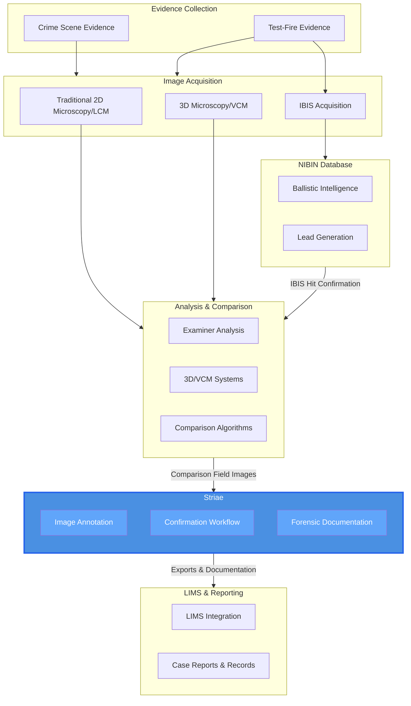

# Striae’s Position in the Firearms Identification Workflow

***

Striae is designed to slot into the existing firearms workflow between image acquisition and case reporting, not to replace microscopes, 3D systems, or NIBIN/IBIS.

* Upstream: Works with images exported from comparison microscopes, VCM platforms like TopMatch, or 3D imaging systems; it treats them as inputs rather than competing with acquisition hardware.

* Midstream: Provides a structured place for examiners to annotate, document, and organize comparison imagery during case analysis and technical review.

* Downstream: Produces annotated images and PDFs that can be incorporated into LIMS reports, discovery packets, or QA documentation, complementing existing LIMS rather than acting as one or replacing it.

A typical use case is an examiner exporting images from a VCM/3D system, loading them into Striae to mark key agreement areas or document algorithmic comparison results, then sharing those annotated images with a peer for confirmation and attaching them to a court‑facing report.

# Striae’s Position in the Forensic Firearms Technology Ecosystem

The broader forensic firearms technology ecosystem currently includes:

* Traditional 2D comparison microscopy and subjective pattern comparison.

* Automated and statistical comparison tools (e.g., cmcR, cmpsR, and other CSAFE/NIST algorithms) plus large 3D datasets.

* Commercial 2D, 3D, and VCM platforms such as TopMatch and EvoFinder that provide image/topography acquisition, triage, database searches, and automated scoring.

* National intelligence systems like NIBIN/IBIS focused on discovering investigative leads.​

Within this landscape, Striae:

* Focuses on human‑driven visual reasoning and documentation, not on algorithmic matching or database searches.

* Bridges traditional, research, and VCM outputs with courtroom‑ready documentation by giving a dedicated layer for transparent, auditable annotations and peer verifications.

* Aligns with the forensic community’s push toward stronger documentation, transparency, and error‑rate research by preserving examiner decisions and rationale at the feature level.

# Why This Matters

* For examiners: It provides a purpose‑built workspace for comparison images that travels with the case file, supports peer verification and technical review, and digitally preserves what you actually looked at and why.

* For labs and QA: It creates a structured, auditable record of annotations and decision points that can support ISO/IEC 17025 documentation, internal/external audits, and clearer, more consistent communication with attorneys and courts.

* For the ecosystem: As an open‑source, tightly-focused, practitioner‑driven tool, it complements vendor systems and research tools by focusing on documentation and review rather than duplicating acquisition or matching capabilities.
